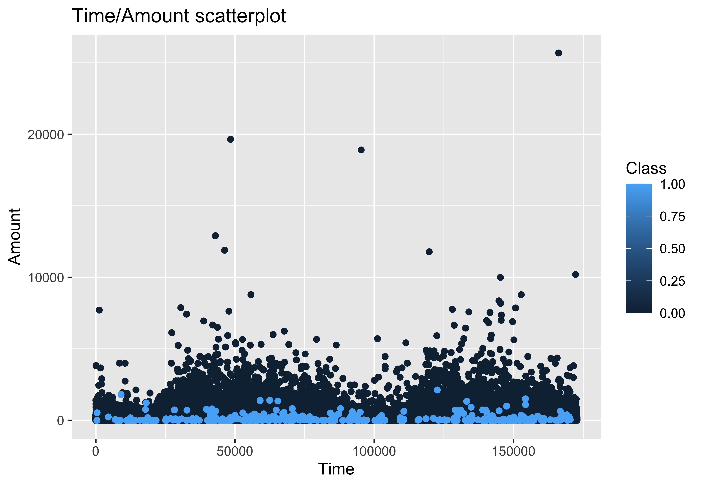
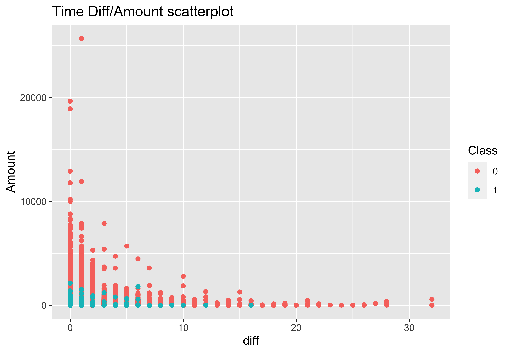
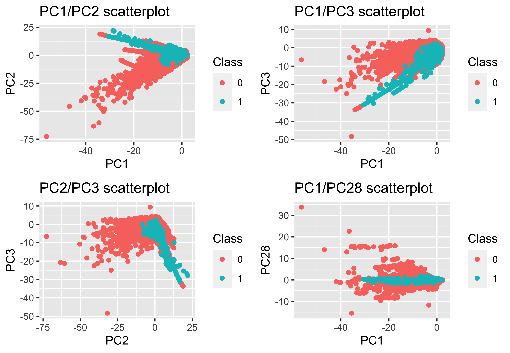

## edX Data Science Professional Certificate
I have recently concluded an online course in Data Science through the **[edX](https://courses.edx.org/dashboard)**. The **[course](https://courses.edx.org/dashboard/programs/3c32e3e0-b6fe-4ee4-bd4f-210c6339e074/)**, is broken up into nine modules covering diverse aspects of data science, from data wrangling to machine learning, through the use of R. 

The final Capstone module involved two machine learning projects that were designed to showcase the skills developed throughout the course. 

### Project 1: MovieLens Recommender System
This project centered on a modified version of the **[MovieLens](https://grouplens.org/datasets/movielens/)** database and in it I created a recommender system through a range of methods, each building on eachother to result in a model that had an RMSE of 0.8602. A pdf report of my work can be found **[here](/pdfs/200328_Capstone_sub.pdf)**. To see the Rmd file click **[here](/pdfs/200328_Capstone_sub.Rmd)**. Techniques used: Data regularisation, Principle Component Analysis

### Project 2: Credit Card Fraud
In the second project we were free to choose what ever dataset we wished. I chose a dataset that dealt with credit card fraud in Europe in 2013 as I get a particular satisfaction from the idea of catching fraudsters. The dataset I chose turned out to be far from trivial as it was good example of highly imbalanced data with respect to the response variable. My **[report](/pdfs/200529_creditcard3.pdf)** highlights a kind of journey of discovery, effectivly showcasing my problem solving methodology rather than just reporting a final polished model. You can also get the Rmd file for the project **[here](/pdfs/200529_creditcard3.Rmd)**. Techinques used: Regression analysis (linear and logistic), Random Forests (Rborist and RandomForest), data balancing (SMOTE). 

#### Project summary.

A quick look at the distribution of tranactions, plotting the amount of each tranaction as a function of time, you can already start to see a trend where by fraudulent transactions tend to be lower in value. Class 1 = Fraud case, Class 2 = Non-fraud. (NOTE: at this point I was still treating the classes as a numerics so the key is a continuum between 0 and 1.)

When I focus instead on plotting amounts of the transaction vs the time that passes since the previous transaction, again a trend starts to be observed. Fruadulent transactions tended to occur in quick succession. Class 1 = Fraud case, Class 2 = Non-fraud.  

However the biggest driver of the model regarding predictive power was a principle component analysis that was already performed on data. The original predictors that yielded these 28 PCs remains hidden from the public (presumably for privacy reasons). Below is a series of plots contrasting low order PCs and high order PCs. The lower order PCs contributed more to sample variance than the higher order PCs. 

Application of random forests to predict fraud was a bit variable in outcome. Being a highly imbalanced dataset I decided to apply the SMOTE algorithm to both over and under sample the dataset to address this imbalance in the response variable. I also decided to apply a Cost Sensitive Learning (CSL) metric to the machine learning algorithm I was building to minimise false negatives (missing a case of fraud) at the expense of false positives (predicting fraud when it was non-fraud). The way I figured it, the banks would rather catch all fraud cases, and have to wade through a few more false positives with closer scrutiny.  
NOTE: perc_o and perc_u are SMOTE parameters the determine the level of over and undersampling respectively. 

The final model was able to predict all fraud cases out of 25633 transactions with only 33 false positives. 

